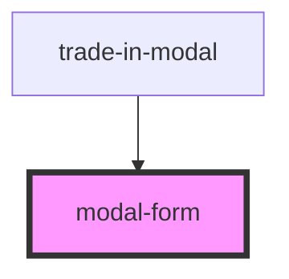

# modal-form

<!-- Auto Generated Below -->

## Properties

| Property   | Attribute  | Description | Type     | Default     |
| ---------- | ---------- | ----------- | -------- | ----------- |
| `callback` | `callback` |             | `string` | `undefined` |

## Events

| Event      | Description | Type                  |
| ---------- | ----------- | --------------------- |
| `__DONE__` |             | `CustomEvent<number>` |

## Dependencies

### Used by

 - [trade-in-modal](../trade-in-modal)

### Graph

----------------------------------------------

*Built with [StencilJS](https://stenciljs.com/)*
