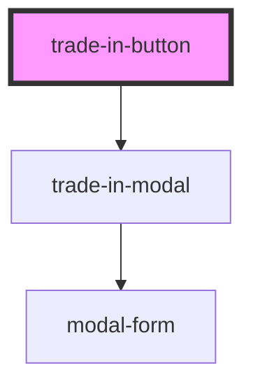

# trade-in-button

<!-- Auto Generated Below -->

## Properties

| Property          | Attribute  | Description | Type     | Default     |
| ----------------- | ---------- | ----------- | -------- | ----------- |
| `onValueReceived` | `callback` |             | `string` | `undefined` |

## Dependencies

### Depends on

- [trade-in-modal](../trade-in-modal)

### Graph

----------------------------------------------

*Built with [StencilJS](https://stenciljs.com/)*
