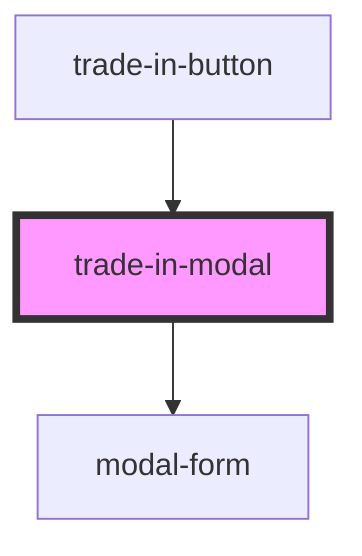

# trade-in-modal

<!-- Auto Generated Below -->

## Properties

| Property   | Attribute  | Description | Type     | Default     |
| ---------- | ---------- | ----------- | -------- | ----------- |
| `callback` | `callback` |             | `string` | `undefined` |

## Dependencies

### Used by

 - [trade-in-button](../trade-in-button)

### Depends on

- [modal-form](../modal-form)

### Graph

----------------------------------------------

*Built with [StencilJS](https://stenciljs.com/)*
